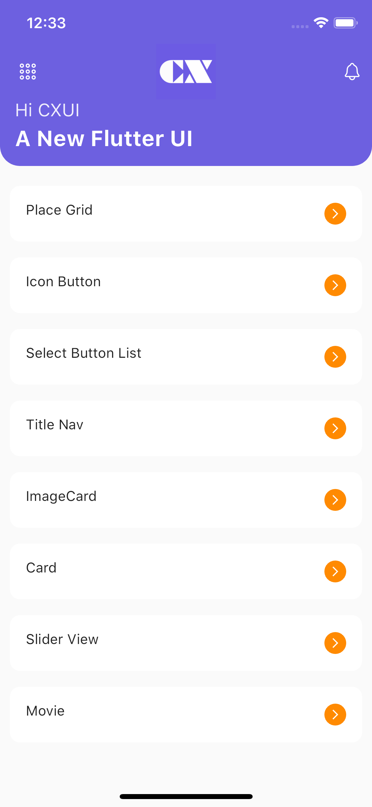
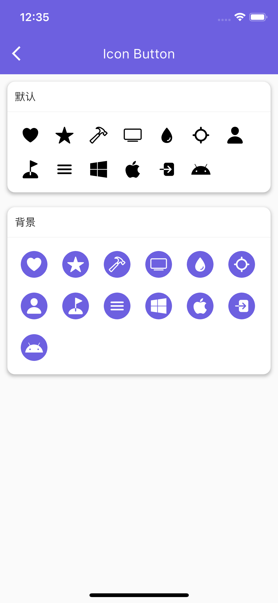
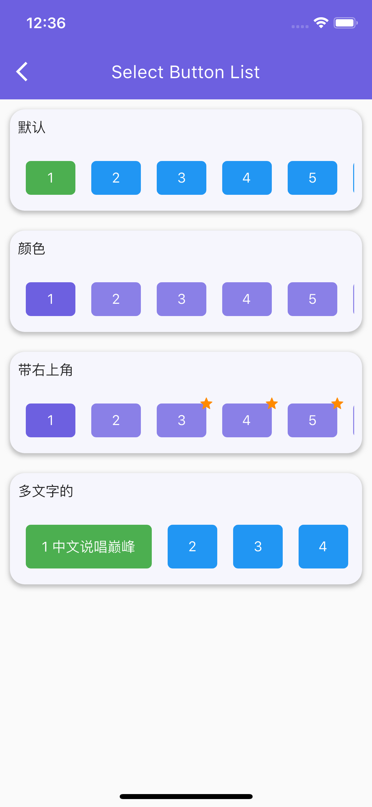
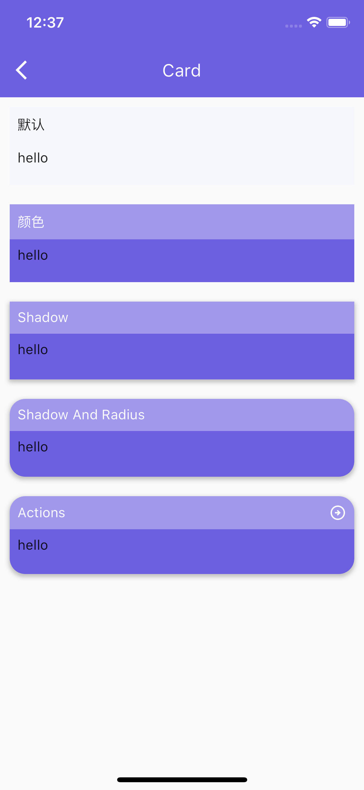
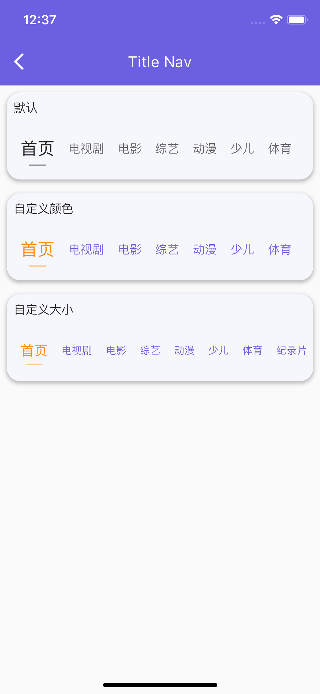
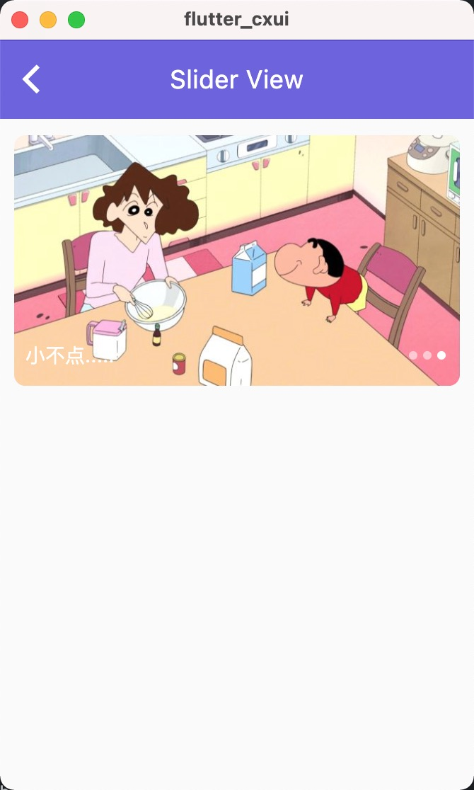
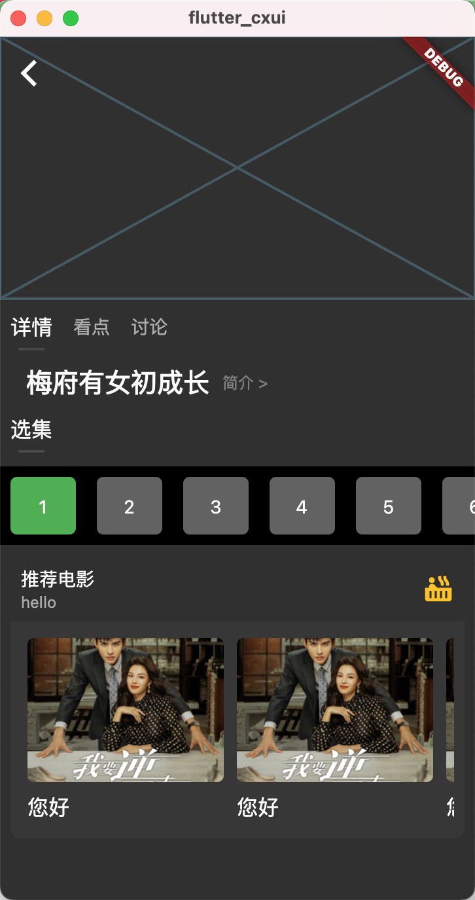

# Flutter CXUI

CXUI是一种基于Flutter的组件库，旨在帮助开发者快速构建多端项目。通过使用CXUI，开发者可以轻松地创建高性能、可扩展、美观的界面，同时实现跨平台兼容性。CXUI提供了丰富的组件、布局和主题，让开发者可以根据需求自由地设计和定制界面。使用CXUI，开发者可以更高效地开发、测试和维护应用程序，同时获得更好的性能和更快的交付。

## 安装

```dart
flutter pub add flutter_cxui
```

## 部分展示

|||
|--|--|
|||
|||
|||
|||

|        |   |
| ----------- | ----------- |
|        |        |
 

